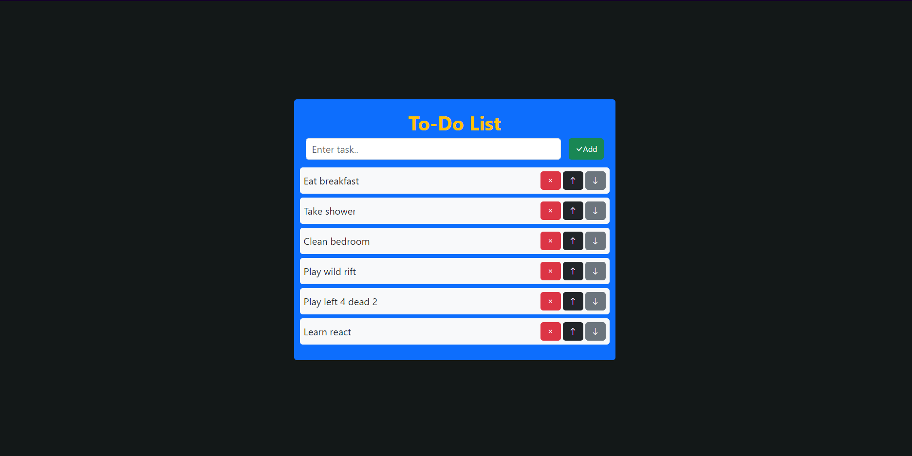

# To Do List with Bootstrap

This project is a simple todo list application built using React + Vite and Bootstrap.

Understanding how useState work in ReactJS

## Features

- Add new tasks to the todo list.
- Delete tasks from the list.
- Move tasks up and down within the list.

## Demo

# react-to-do-list
